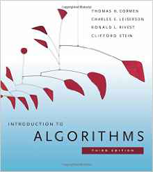
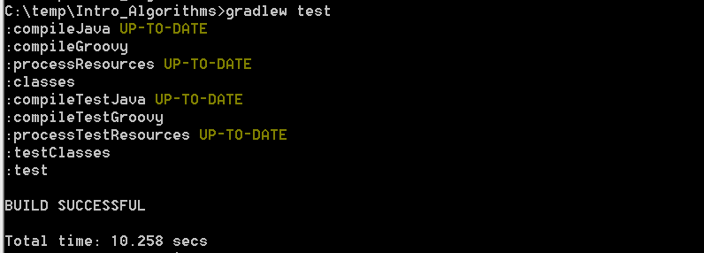
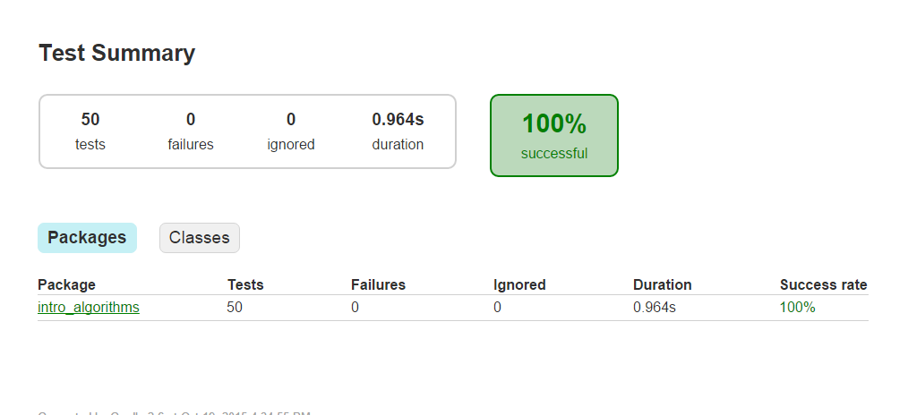
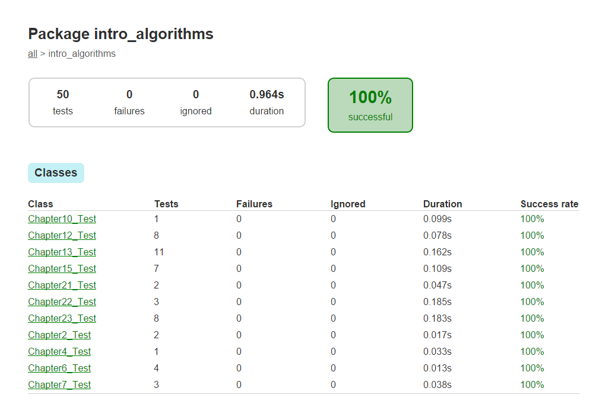
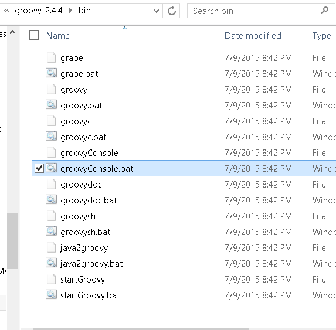
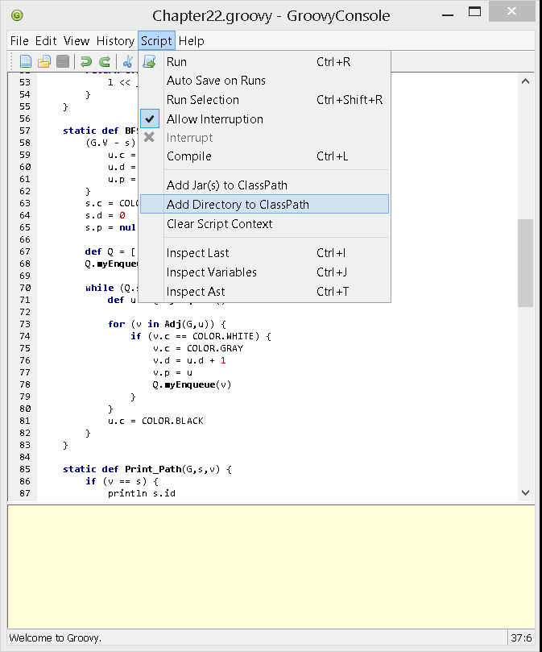
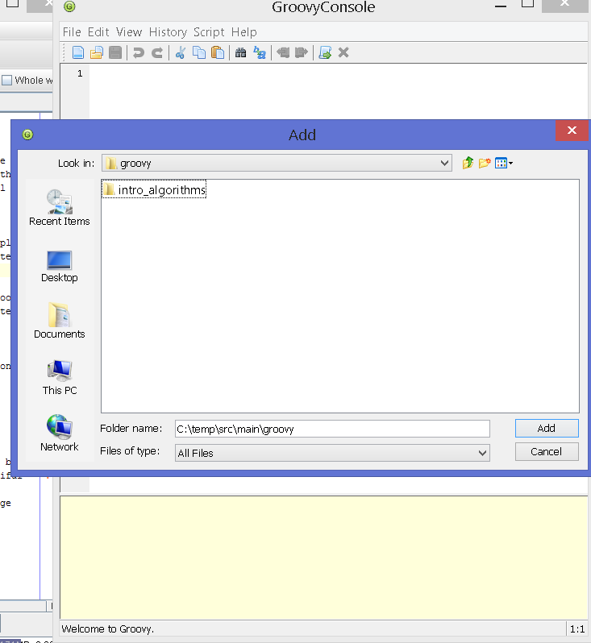
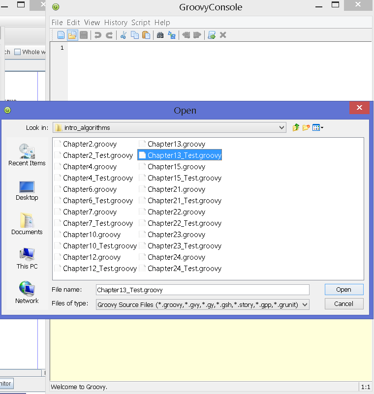
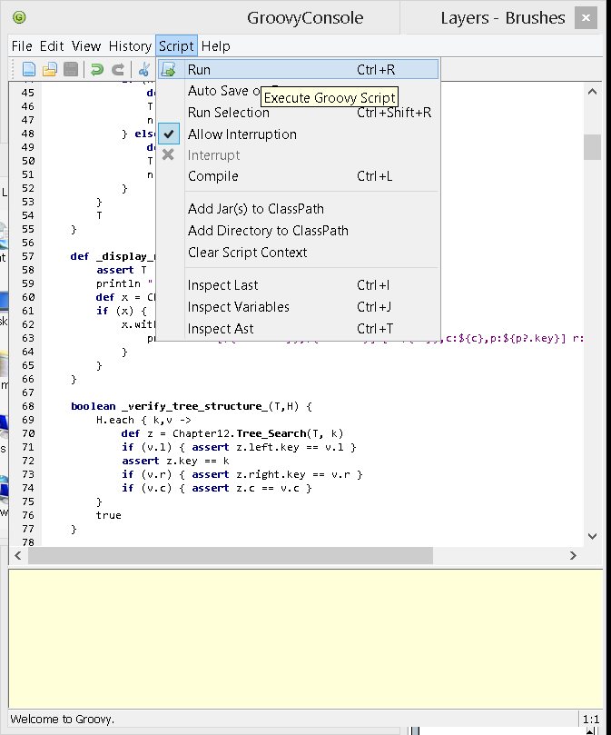
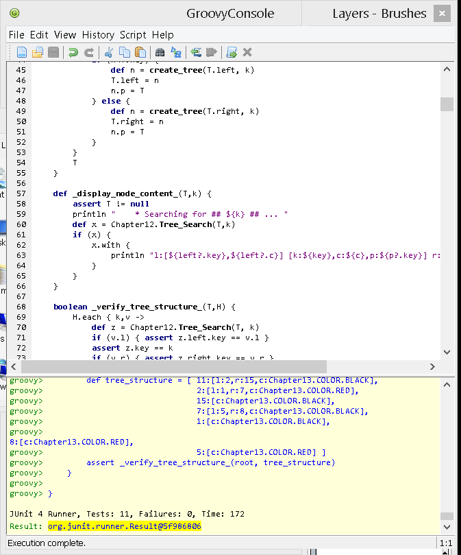

Intro to Algorithms
===================




* This project grew out of need to rapidly test my ideas using algorithms from **the** authoritative source
* Conciseness, expressivity, and brevity are beautiful
* Rapid prototyping and testing of algorithms without fighting the language syntax or IDE
* No confusing C/C++/Java templating syntax to decipher 
* Built-in Gradle workflow


There are 2 options to run / exercise the code: `gradle` and `groovyConsole`


### Gradle

* Run the included gradle wrapper

```
gradlew test
``` 
    


* View the generated report 






### groovyConsole

* To use groovyConsole, launch `groovyConsole` or `groovyConsole.bat` from groovy/bin directory




* Add `src/main/groovy` directory to classpath  






* Load unittest




* Run the loaded script. Script -> Run or Ctrl-R to run




* Execution result should appear in the bottom panel 




